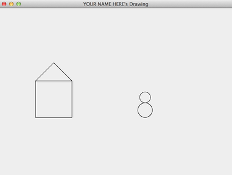

# F16_lab04

Base repository for CS56 F16 lab04 (Open Source)

# Student Instructions

See: https://ucsb-cs56-f16.github.io/lab/lab04/

# How to run this code (originally: grader hints)

Originally, this section of the README.md was called *grader hints*, but is occurred to me that
students completing the assignment should probably read this also.    These are the commands
that the TA, Reader, Instructor are going to use to check your work, so it will benefit you to
run these commands also.

In addition, you can see examples of some past student work that illustrates what you are supposed 
to do in this assignment.

# Overview

* Use <code>ant -p</code> to see all available tasks
* The grader tasks include these:

<pre>
 gradeMPV1          run MultiPictureViewer for studentName with arg 1
 gradeMPV2          run MultiPictureViewer for studentName with arg 2
 gradeMPV3          run MultiPictureViewer for studentName with arg 3
 gradePV            run simple.PictureViewer for student in studentName property
 gradeSimpleGui1    run simpleGui1 for student in studentName property
</pre>

To run one of those tasks, overriding the student's CSIL id to jgaucho, use, for example:

<code>ant -DstudentName=jgaucho gradePV</code>

You can test this with studentName set to <code>pconrad</code>, <code>andrewberls</code>, or <code>jstaahl</code> as examples.   All of those should work on pconrad, though only the MPV tasks will work for the other two.

# Detail

## Showing the House and Incomplete Snowman

Try executing the following:

<code>ant -DstudentName=pconrad gradePV</code>

What you should see will look something like this:

{: style="float:right; width: 50%;" }

This is sample output from the program [src/edu/ucsb/cs56/drawings/pconrad/simple/PictureViewer.java](https://github.com/UCSB-CS56-F16/F16-lab04/blob/master/src/edu/ucsb/cs56/drawings/pconrad/simple/PictureViewer.java).

It shows code that was drawn by [F16-lab04/src/edu/ucsb/cs56/drawings/pconrad/simple/PictureComponent.java](https://github.com/UCSB-CS56-F16/F16-lab04/blob/master/src/edu/ucsb/cs56/drawings/pconrad/simple/PictureComponent.java), which draws a simple House, and an incomplete snowman.

One of your "warmup exercises" is to try to complete your own version of this snowman (or, if you prefer, "person of snow".)

## Showing examples of three drawings from each of  two  student submissions:

Now try these commands: 

* <code>ant -DstudentName=aberls gradeMPV1 </code>
* <code>ant -DstudentName=aberls gradeMPV2 </code>
* <code>ant -DstudentName=aberls gradeMPV3 </code>
* <code>ant -DstudentName=jstaahl gradeMPV1 </code>
* <code>ant -DstudentName=jstaahl gradeMPV2 </code>
* <code>ant -DstudentName=jstaahl gradeMPV3 </code>

What you should see in the first three cases are three pictures defined by three methods of the class `edu.ucsb.cs56.drawings.andrewberls.advanced.AllMyDrawings`

* [drawPicture1()](https://github.com/UCSB-CS56-F16/F16-lab04/blob/master/src/edu/ucsb/cs56/drawings/andrewberls/advanced/AllMyDrawings.java#L31)
* [drawPicture2()](https://github.com/UCSB-CS56-F16/F16-lab04/blob/master/src/edu/ucsb/cs56/drawings/andrewberls/advanced/AllMyDrawings.java#L49)
* [drawPicture3()](https://github.com/UCSB-CS56-F16/F16-lab04/blob/master/src/edu/ucsb/cs56/drawings/andrewberls/advanced/AllMyDrawings.java#L70)

All of those are the result of the two iPod images defined in these classes, one of which inherits from the other:

* [`edu.ucsb.cs56.drawings.andrewberls.advanced.IPod`](https://github.com/UCSB-CS56-F16/F16-lab04/blob/master/src/edu/ucsb/cs56/drawings/andrewberls/advanced/Ipod.java)
* [`edu.ucsb.cs56.drawings.andrewberls.advanced.IPodDetail`](https://github.com/UCSB-CS56-F16/F16-lab04/blob/master/src/edu/ucsb/cs56/drawings/andrewberls/advanced/IpodDetail.java)

Similarly, the second three images are the result of the methods of the class
`edu.ucsb.cs56.drawings.jstaahl.advanced.AllMyDrawings`

* [drawPicture1()](https://github.com/UCSB-CS56-F16/F16-lab04/blob/master/src/edu/ucsb/cs56/drawings/jstaahl/advanced/AllMyDrawings.java#L31)
* [drawPicture2()](https://github.com/UCSB-CS56-F16/F16-lab04/blob/master/src/edu/ucsb/cs56/drawings/jstaahl/advanced/AllMyDrawings.java#L71)
* [drawPicture3()](https://github.com/UCSB-CS56-F16/F16-lab04/blob/master/src/edu/ucsb/cs56/drawings/jstaahl/advanced/AllMyDrawings.java#L121)

All of those are the result of the two pencil images defined in these classes, one of which inherits from the other:

* [`edu.ucsb.cs56.drawings.jstaahl.advanced.Pencil`](https://github.com/UCSB-CS56-F16/F16-lab04/blob/master/src/edu/ucsb/cs56/drawings/jstaahl/advanced/Pencil.java)
* [`edu.ucsb.cs56.drawings.jstaahl.advanced.SharpenedPencil`](https://github.com/UCSB-CS56-F16/F16-lab04/blob/master/src/edu/ucsb/cs56/drawings/jstaahl/advanced/SharpenedPencil.java)

